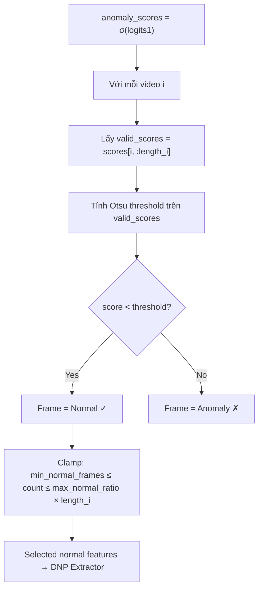

# RUPA-DSA v0

**Video-specific counterfactual normal reconstruction with category-aware residual semantic alignment for weakly supervised video anomaly detection.**

RUPA-DSA v0 extends [DSANet](https://github.com/lessiYin/DSANet) with counterfactual reconstruction, residual semantic alignment, and fixed closed-loop routing:

```text
F_video --video-specific DNP--> F_rec
R = F_video - F_rec

F_rec + DNP <--> normal text
R             <--> anomaly-category text

S* = w_det S_det + w_rec S_rec + w_sem S_sem
```

The narrow research contribution is the structured combination of video-specific normal reconstruction and category-aware residual–text alignment. This repository does not claim that prototypes, reconstruction error, residual learning, or CLIP alignment are individually new.

## Repository structure

```text
RUPA-DSA-v0/
├── RUPA_DSA_Kaggle.ipynb   # Kaggle runner; clones this repository directly
├── RUPA_DSA.md              # method and ablation protocol
├── environment.yml
├── requirements.txt
├── assets/
├── list/                    # CSV manifests and evaluation annotations
└── src/
    ├── model.py             # RUPA reconstruction/residual/routing
    ├── ucf_train.py
    ├── ucf_test.py
    ├── xd_train.py
    ├── xd_test.py
    ├── clip/
    └── utils/
```

Feature archives, checkpoints, and outputs are intentionally excluded by `.gitignore`.

## Train on Kaggle

1. Import `RUPA_DSA_Kaggle.ipynb` into Kaggle.
2. Enable **GPU** and **Internet**.
3. For UCF-Crime, attach `UCFClipFeatures.zip` and set `DATASET = "ucf"`.
4. For XD-Violence, attach `XDTrainClipFeatures.zip` plus `XDTestClipFeatures.zip` and set `DATASET = "xd"`.
5. Run all cells.
6. Download `RUPA_DSA_v0_<dataset>_results.zip` from `/kaggle/working/rupa_v0_artifacts`.

The notebook executes:

```bash
git clone --depth 1 https://github.com/Sharvuz/RUPA-DSA-v0.git
```

There is no embedded/base64 source overlay. Every Kaggle run therefore uses the current code on GitHub, or the optional `REPO_REF` commit/tag configured in the notebook.

## Local environment

```bash
conda env create -f environment.yml
conda activate rupa-dsa
```

Alternatively, install a CUDA-compatible PyTorch build first and then run:

```bash
pip install -r requirements.txt
```

## Direct CLI training

Update the feature paths in the CSV manifests or pass mapped CSV files explicitly:

```bash
python src/ucf_train.py \
  --train-list list/ucf_CLIP_rgb.csv \
  --test-list list/ucf_CLIP_rgbtest.csv \
  --model-path model/best_ucf.pth \
  --checkpoint-path model/checkpoint_ucf.pth

python src/xd_train.py \
  --train-list list/xd_CLIP_rgb.csv \
  --test-list list/xd_CLIP_rgbtest.csv \
  --model-path model/best_xd.pth \
  --checkpoint-path model/checkpoint_xd.pth
```

All RUPA routing and loss weights are exposed in `src/ucf_option.py` and `src/xd_option.py`. See [RUPA_DSA.md](RUPA_DSA.md) for the recommended ablations.

## Attribution

This codebase is derived from the official DSANet implementation:

```bibtex
@inproceedings{yin2026learning,
  title={Learning to Tell Apart: Weakly Supervised Video Anomaly Detection via Disentangled Semantic Alignment},
  author={Yin, Wenti and Zhang, Huaxin and Wang, Xiang and Lu, Yuqing and Zhang, Yicheng and Gong, Bingquan and Zuo, Jialong and Yu, Li and Gao, Changxin and Sang, Nong},
  booktitle={Proceedings of the AAAI Conference on Artificial Intelligence},
  year={2026}
}
```

Cải tiên v2. # Cải tiến 2: Adaptive Normal Selection (Lựa chọn khung hình bình thường động)

## Bối cảnh

Trong SGNM (Self-Guided Normality Modeling), số khung hình được chọn làm "bình thường" hiện bị cố định bởi `normal_selection_ratio` (mặc định 0.125 hoặc 0.8). Khi video chứa sự kiện bất thường chiếm phần lớn thời lượng, tỷ lệ cố định có thể lấy nhầm khung hình bất thường vào bộ đặc trưng bình thường (contamination).

**Giải pháp**: Thay vì cố định tỷ lệ, sử dụng thuật toán **Otsu's thresholding** trên phổ điểm số anomaly `S_det = sigmoid(logits1)` để tự động xác định ngưỡng cắt cho từng video. Các frame có `anomaly_score < threshold_otsu` sẽ được coi là "bình thường". Nếu video quá bất thường, rất ít frame sẽ được chọn.

## Proposed Changes

### SGNM Module — Adaptive Normal Selection

#### [MODIFY] [model.py](file:///c:/Users/huynh/Downloads/dsanet/RUPA-DSAv2/src/model.py)

Thay đổi chính trong class `SGNM`:

1. **Thêm hàm `otsu_threshold_1d`**: Hàm tĩnh thực hiện Otsu's method trên 1D tensor (phổ anomaly scores) để tìm ngưỡng tối ưu phân tách 2 nhóm (normal vs anomaly).

2. **Thêm tham số `adaptive_normal_selection`** vào `__init__`: Bool flag cho phép bật/tắt tính năng này. Khi `True`, dùng Otsu; khi `False`, fallback về `normal_selection_ratio` cố định (backward compatible).

3. **Thêm tham số `min_normal_frames`** và **`max_normal_ratio`**: Giới hạn an toàn:
   - `min_normal_frames`: Tối thiểu luôn lấy ít nhất N frame (mặc định 4) để tránh trường hợp Otsu chọn 0 frame.
   - `max_normal_ratio`: Tỷ lệ tối đa frame được chọn (mặc định 0.8) để tránh lấy quá nhiều frame khi video hoàn toàn bình thường.

4. **Sửa logic trong `forward()`**: Thay thế dòng tính `num_normal_frames` cố định bằng logic adaptive:
   - Với mỗi video trong batch, tính Otsu threshold trên anomaly scores hợp lệ
   - Đếm số frame có score < threshold → đó là `num_normal_frames` cho video đó
   - Áp dụng giới hạn `min_normal_frames` và `max_normal_ratio`
   - Vì mỗi video trong batch có thể có số frame normal khác nhau, sử dụng **padding + mask** để xử lý batched tensor

Cụ thể, flow mới:

```
anomaly_scores = sigmoid(logits1)  # [B, N]
for each video i in batch:
    valid_scores = anomaly_scores[i, :lengths[i]]
    threshold = otsu_threshold_1d(valid_scores)
    normal_mask[i] = (anomaly_scores[i] < threshold) & valid_mask[i]
    # clamp to [min_normal_frames, max_normal_ratio * lengths[i]]
```

> [!IMPORTANT]
> **Xử lý batch**: Vì mỗi video có số frame normal khác nhau, ta cần chuyển sang logic sử dụng mask thay vì `torch.topk` với k cố định. Cụ thể:
>
> - Dùng mask để zero-out các frame không được chọn
> - Weighted average thay vì gather + fixed-k

---

### Option Files — Thêm hyperparameters

#### [MODIFY] [ucf_option.py](file:///c:/Users/huynh/Downloads/dsanet/RUPA-DSAv2/src/ucf_option.py)

Thêm 3 tham số mới:

- `--adaptive_normal_selection` (bool, default=True)
- `--min_normal_frames` (int, default=4)
- `--max_normal_ratio` (float, default=0.8)

#### [MODIFY] [xd_option.py](file:///c:/Users/huynh/Downloads/dsanet/RUPA-DSAv2/src/xd_option.py)

Thêm 3 tham số tương tự.

---

### DSANet Constructor — Truyền tham số

#### [MODIFY] [model.py](file:///c:/Users/huynh/Downloads/dsanet/RUPA-DSAv2/src/model.py) (DSANet class)

Sửa phần khởi tạo `self.video_anomaly_refiner = SGNM(...)` để truyền thêm các tham số mới từ `args`.

## Tóm tắt luồng hoạt động mới



## Verification Plan

### Automated Tests

- Chạy training UCF: `python src/ucf_trains.py --max-epoch 1 --adaptive_normal_selection True`
- Chạy training UCF với fallback: `python src/ucf_train.py --max-epoch 1 --adaptive_normal_selection False`
- Kiểm tra model khởi tạo thành công, forward pass không lỗi

### Manual Verification

- In ra thống kê số frame normal được chọn per-video qua mỗi batch để xác minh Otsu thay đổi động
- So sánh training loss giữa adaptive vs fixed ratio
